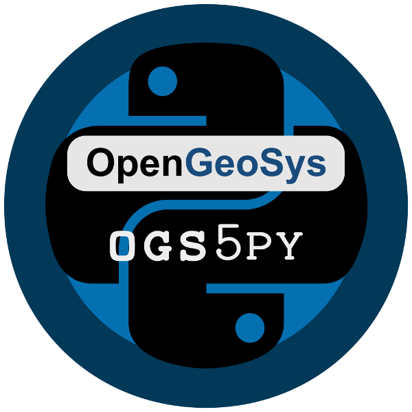
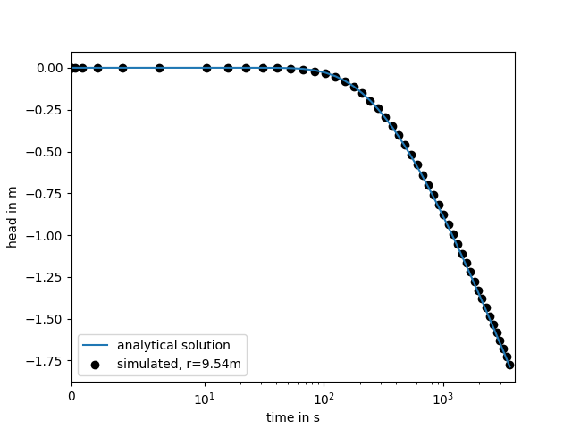

=================
ogs5py Quickstart
=================

ogs5py is A python-API for the `OpenGeoSys 5 <https://www.opengeosys.org/ogs-5/>`_ scientific modeling package.

Installation
============

The package can be installed via `pip <https://pypi.org/project/gstools/>`_.
On Windows you can install `WinPython <https://winpython.github.io/>`_ to get
Python and pip running.

.. code-block:: none

    pip install ogs5py

Further Information
===================

- General homepage: https://www.opengeosys.org/ogs-5
- OGS5 Repository: https://github.com/ufz/ogs5
- Keyword documentation: https://ogs5-keywords.netlify.com
- OGS5 Benchmarks: https://github.com/ufz/ogs5-benchmarks
- ogs5py Benchmarks: https://github.com/GeoStat-Framework/ogs5py_benchmarks

Pumping Test Example
====================

In the following a simple transient pumping test is simulated on a radial symmetric mesh.
The point output at the observation well is plotted afterwards.

.. code-block:: python

    from ogs5py import OGS
    from ogs5py.reader import readtec_point
    from matplotlib import pyplot as plt

    model = OGS(task_root="pump_test", task_id="model")

    # generate a radial mesh
    model.msh.generate("radial", dim=2, rad=range(51))
    # generate a radial outer boundary
    model.gli.generate("radial", dim=2, rad_out=50.)
    model.gli.add_points([0., 0., 0.], "pwell")
    model.gli.add_points([1., 0., 0.], "owell")

    model.bc.add_block(  # boundary condition
        PCS_TYPE='GROUNDWATER_FLOW',
        PRIMARY_VARIABLE='HEAD',
        GEO_TYPE=['POLYLINE', "boundary"],
        DIS_TYPE=['CONSTANT', 0.0],
    )
    model.st.add_block(  # source term
        PCS_TYPE='GROUNDWATER_FLOW',
        PRIMARY_VARIABLE='HEAD',
        GEO_TYPE=['POINT', "pwell"],
        DIS_TYPE=['CONSTANT_NEUMANN', -1.0e-04],
    )
    model.ic.add_block(  # initial condition
        PCS_TYPE='GROUNDWATER_FLOW',
        PRIMARY_VARIABLE='HEAD',
        GEO_TYPE='DOMAIN',
        DIS_TYPE=['CONSTANT', 0.0],
    )
    model.mmp.add_block(  # medium properties
        GEOMETRY_DIMENSION=2,
        STORAGE=[1, 1.0e-04],
        PERMEABILITY_TENSOR=['ISOTROPIC', 1.0e-4],
        POROSITY=0.2,
    )
    model.num.add_block(  # numerical solver
        PCS_TYPE='GROUNDWATER_FLOW',
        LINEAR_SOLVER=[2, 5, 1.0e-14, 1000, 1.0, 100, 4],
    )
    model.out.add_block(  # point observation
        PCS_TYPE='GROUNDWATER_FLOW',
        NOD_VALUES='HEAD',
        GEO_TYPE=['POINT', "owell"],
        DAT_TYPE='TECPLOT',
        TIM_TYPE=['STEPS', 1],
    )
    model.pcs.add_block(  # set the process type
        PCS_TYPE='GROUNDWATER_FLOW',
        NUM_TYPE='NEW',
    )
    model.tim.add_block(  # set the timesteps
        PCS_TYPE='GROUNDWATER_FLOW',
        TIME_START=0,
        TIME_END=600,
        TIME_STEPS=[
            [10, 30],
            [5, 60],
        ],
    )
    model.write_input()
    success = model.run_model()

    point = readtec_point(
        task_root="pump_test",
        task_id="model",
        pcs='GROUNDWATER_FLOW',
    )
    time = point['owell']["TIME"]
    head = point['owell']["HEAD"]

    plt.plot(time, head)
    plt.show()

Reader
======

It comes along with a set of handy readers for almost all output formats:

- VTK Domain output:
    :any:`ogs5py.reader.readvtk`
- PVD Domain output:
    :any:`ogs5py.reader.readpvd`
- TECPLOT point output:
    :any:`ogs5py.reader.readtec_point`
- TECPLOT polyline output:
    :any:`ogs5py.reader.readtec_polyline`

OGS5 executable
===============

The OGS5 executable needs to be in your sys-path under ``ogs[.exe]``.
Otherwise you need to specify the path to the executable within the run command:

.. code-block:: python

    model.run_model(ogs_root="path/to/ogs")

Requirements
============

- `NumPy >= 1.13.0 <https://www.numpy.org>`_
- `Pandas >= 0.23.0 <https://pandas.pydata.org/>`_
- `whichcraft <https://github.com/pydanny/whichcraft>`_
- `meshio <https://github.com/nschloe/meshio>`_
- `lxml <https://github.com/lxml/lxml>`_
- `vtk <https://vtk.org/>`_
- `pexpect <https://github.com/pexpect/pexpect>`_

License
=======

`GPL <https://github.com/GeoStat-Framework/ogs5py/blob/master/LICENSE>`_ © 2018
