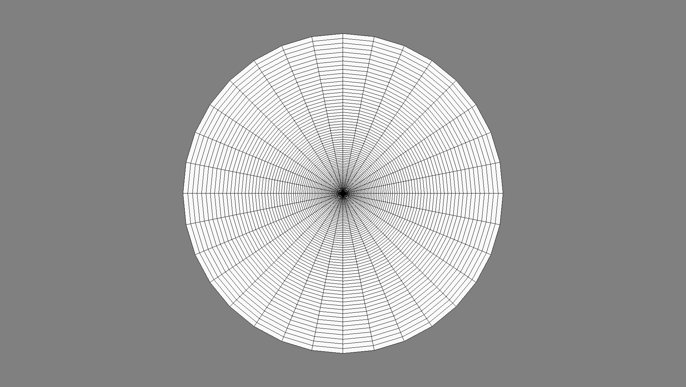

Tutorial 1: A pumping test
==========================

This is a minimal example on how to setup a pumping test with ogs5py.
The result was plotted against the analytical solution.

In this example we use the :any:`generate_time` function, to use
an array of time points for the time stepping definition.

.. code-block:: python

    model.tim.add_block(**generate_time(time))

is equivalent to:

.. code-block:: python

    model.tim.add_block(
        TIME_START=0,
        TIME_END=time[-1],
        TIME_STEPS=[
            [1, time[0]],
            [1, time[1]],
            [1, time[2]],
            # ...
        ],
    )

The script:

.. code-block:: python

    import anaflow as ana
    from ogs5py import OGS, specialrange, generate_time
    from matplotlib import pyplot as plt

    # discretization and parameters
    time = specialrange(0, 3600, 50, typ="cub")
    rad = specialrange(0, 1000, 100, typ="cub")
    obs = rad[21]
    angles = 32
    storage = 1e-3
    transmissivity = 1e-4
    rate = -1e-3
    # model setup
    model = OGS(task_root="pump_test", task_id="model")
    model.pcs.add_block(  # set the process type
        PCS_TYPE="GROUNDWATER_FLOW", NUM_TYPE="NEW"
    )
    # generate a radial mesh and geometry ("boundary" polyline)
    model.msh.generate("radial", dim=2, rad=rad, angles=angles)
    model.gli.generate("radial", dim=2, rad_out=rad[-1], angles=angles)
    model.gli.add_points([0.0, 0.0, 0.0], "pwell")
    model.gli.add_points([obs, 0.0, 0.0], "owell")
    model.bc.add_block(  # boundary condition
        PCS_TYPE="GROUNDWATER_FLOW",
        PRIMARY_VARIABLE="HEAD",
        GEO_TYPE=["POLYLINE", "boundary"],
        DIS_TYPE=["CONSTANT", 0.0],
    )
    model.ic.add_block(  # initial condition
        PCS_TYPE="GROUNDWATER_FLOW",
        PRIMARY_VARIABLE="HEAD",
        GEO_TYPE="DOMAIN",
        DIS_TYPE=["CONSTANT", 0.0],
    )
    model.st.add_block(  # source term
        PCS_TYPE="GROUNDWATER_FLOW",
        PRIMARY_VARIABLE="HEAD",
        GEO_TYPE=["POINT", "pwell"],
        DIS_TYPE=["CONSTANT_NEUMANN", rate],
    )
    model.mmp.add_block(  # medium properties
        GEOMETRY_DIMENSION=2,
        STORAGE=[1, storage],
        PERMEABILITY_TENSOR=["ISOTROPIC", transmissivity],
    )
    model.num.add_block(  # numerical solver
        PCS_TYPE="GROUNDWATER_FLOW",
        LINEAR_SOLVER=[2, 5, 1e-14, 1000, 1.0, 100, 4]
    )
    model.out.add_block(  # point observation
        PCS_TYPE="GROUNDWATER_FLOW",
        NOD_VALUES="HEAD",
        GEO_TYPE=["POINT", "owell"],
        DAT_TYPE="TECPLOT",
    )
    model.tim.add_block(  # set the timesteps
        PCS_TYPE="GROUNDWATER_FLOW",
        **generate_time(time)  # generate input from time-series
    )
    model.write_input()
    success = model.run_model()
    print("success:", success)
    # observation
    point = model.readtec_point(pcs="GROUNDWATER_FLOW")
    time = point["owell"]["TIME"]
    head = point["owell"]["HEAD"]
    # analytical solution
    head_ana = ana.theis(time, obs, storage, transmissivity, rate=rate)
    # comparisson plot
    plt.scatter(time, head, color="k", label="simulated, r={:04.2f}m".format(obs))
    plt.plot(time, head_ana, label="analytical solution")
    plt.xscale("symlog", linthreshx=10, subsx=range(1, 10))
    plt.xlim([0, 1.1 * time[-1]])
    plt.xlabel("time in s")
    plt.ylabel("head in m")
    plt.legend()
    plt.show()
    # show mesh
    model.msh.show()

.. image:: pics/01_pump_test_drawdown.png
   :width: 400px
   :align: center

