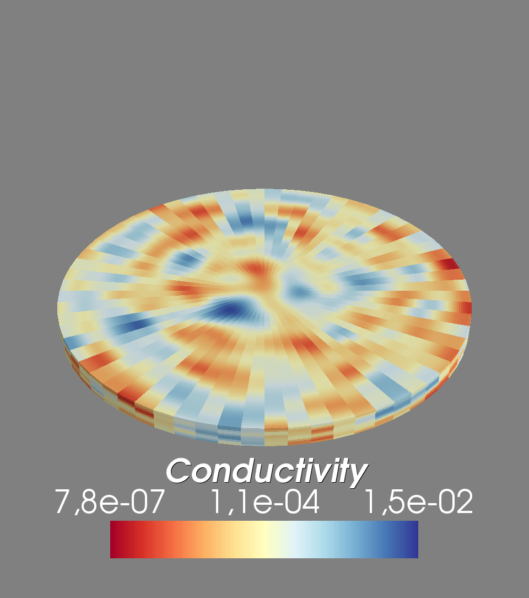
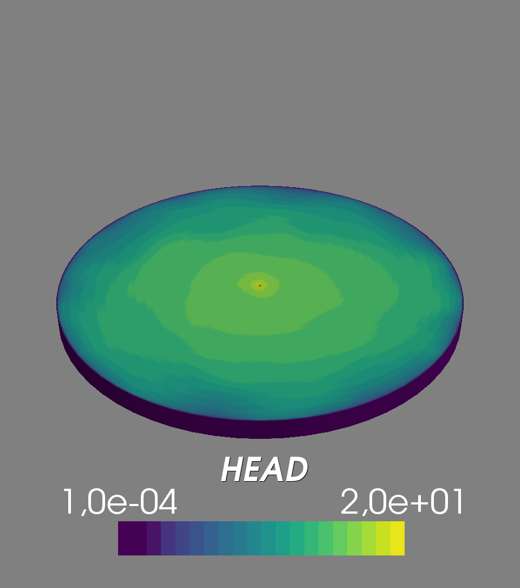

Tutorial 2: Interaction with GSTools
====================================

In this example we are generating a log-normal dirtributed
conductivity field on a generated mesh with the aid of
`GSTools <https://github.com/GeoStat-Framework/GSTools>`_.
and perform a steady pumping test.

.. code-block:: python

    import numpy as np
    from ogs5py import OGS, by_id, show_vtk
    from gstools import SRF, Gaussian

    # covariance model for conductivity field
    cov_model = Gaussian(dim=3, var=2, len_scale=10, anis=[1, 0.2])
    srf = SRF(model=cov_model, mean=-9, seed=1000)
    # model setup
    model = OGS(task_root="test_het_3D", task_id="model", output_dir="out")
    model.pcs.add_block(  # set the process type
        PCS_TYPE="GROUNDWATER_FLOW", NUM_TYPE="NEW", TIM_TYPE="STEADY"
    )
    # generate a radial 3D mesh and conductivity field
    model.msh.generate(
        "radial", dim=3, angles=64, rad=np.arange(101), z_arr=-np.arange(11)
    )
    cond = np.exp(srf.mesh(model.msh))
    model.mpd.add(name="conductivity")
    model.mpd.add_block(  # edit recent mpd file
        MSH_TYPE="GROUNDWATER_FLOW",
        MMP_TYPE="PERMEABILITY",
        DIS_TYPE="ELEMENT",
        DATA=by_id(cond),
    )
    model.mmp.add_block(  # permeability, storage and porosity
        GEOMETRY_DIMENSION=3, PERMEABILITY_DISTRIBUTION=model.mpd.file_name
    )
    model.gli.generate("radial", dim=3, angles=64, rad_out=100, z_size=-10)
    model.gli.add_polyline("pwell", [[0, 0, 0], [0, 0, -10]])
    for srf in model.gli.SURFACE_NAMES:  # set boundary condition
        model.bc.add_block(
            PCS_TYPE="GROUNDWATER_FLOW",
            PRIMARY_VARIABLE="HEAD",
            GEO_TYPE=["SURFACE", srf],
            DIS_TYPE=["CONSTANT", 0.0],
        )
    model.st.add_block(  # set pumping condition at the pumpingwell
        PCS_TYPE="GROUNDWATER_FLOW",
        PRIMARY_VARIABLE="HEAD",
        GEO_TYPE=["POLYLINE", "pwell"],
        DIS_TYPE=["CONSTANT_NEUMANN", 1.0e-3],
    )
    model.num.add_block(  # numerical solver
        PCS_TYPE="GROUNDWATER_FLOW",
        LINEAR_SOLVER=[2, 5, 1.0e-14, 1000, 1.0, 100, 4],
    )
    model.out.add_block(  # set the outputformat
        PCS_TYPE="GROUNDWATER_FLOW",
        NOD_VALUES="HEAD",
        GEO_TYPE="DOMAIN",
        DAT_TYPE="VTK",
    )
    model.write_input()
    success = model.run_model()

    model.msh.show(show_cell_data={"Conductivity": cond}, log_scale=True)
    files = model.output_files(pcs="GROUNDWATER_FLOW", typ="VTK")
    show_vtk(files[-1], log_scale=True)  # show the last time-step

