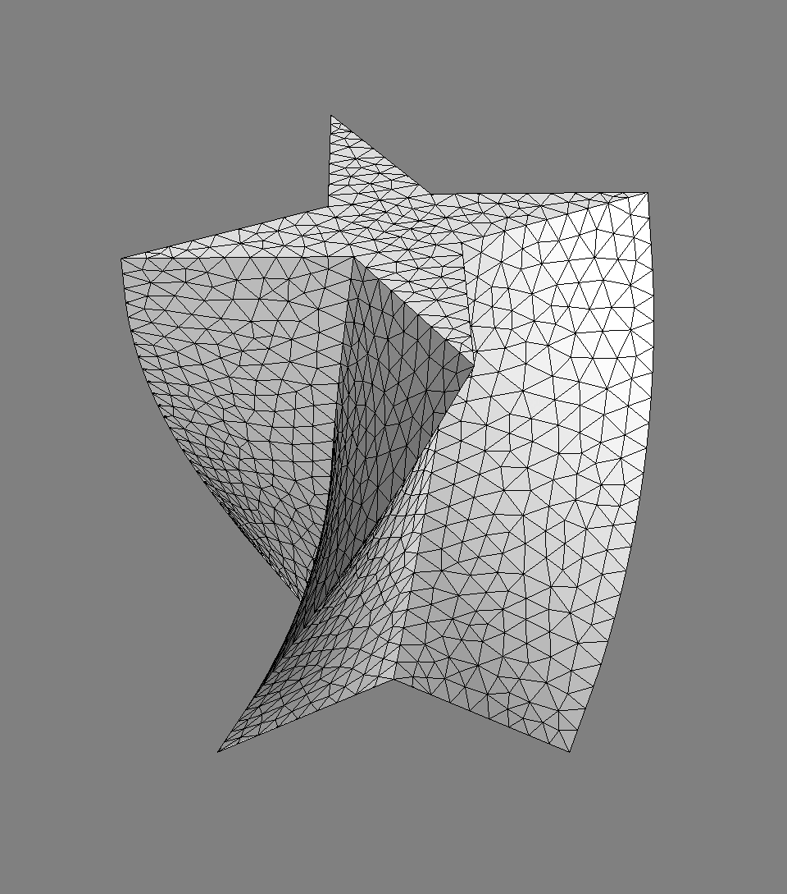
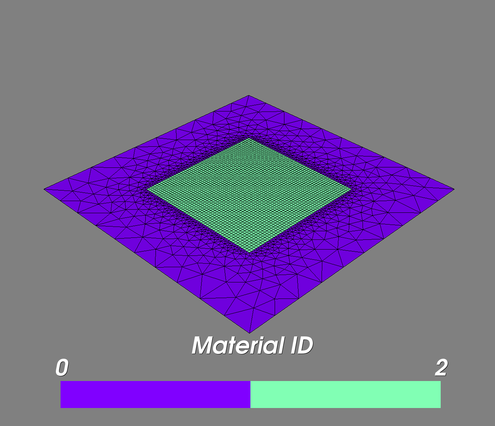
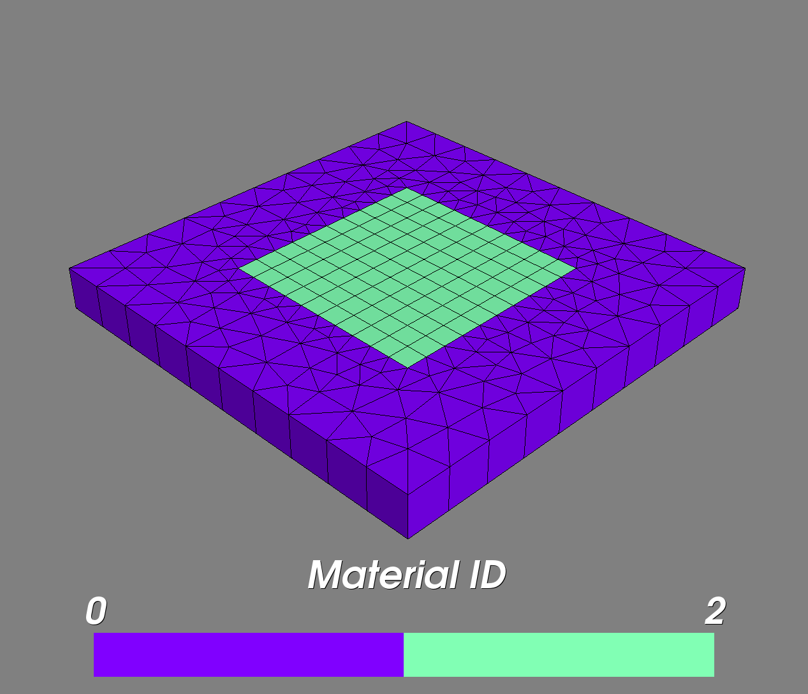
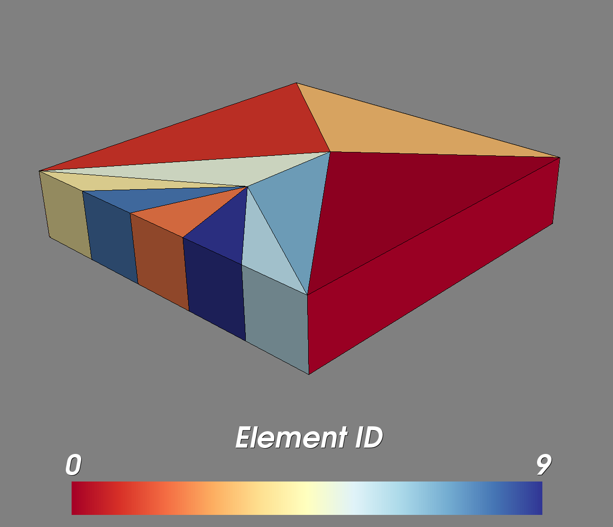

Tutorial 2: Interaction with pygmsh
===================================

In this example we are generating different meshes with the aid of
`pygmsh <https://github.com/nschloe/pygmsh>`_..

.. code-block:: python

    import numpy as np
    from ogs5py import OGS
    import pygmsh

    geom = pygmsh.built_in.Geometry()
    poly = geom.add_polygon([
        [ 0.0,  0.5, 0.0],
        [-0.1,  0.1, 0.0],
        [-0.5,  0.0, 0.0],
        [-0.1, -0.1, 0.0],
        [ 0.0, -0.5, 0.0],
        [ 0.1, -0.1, 0.0],
        [ 0.5,  0.0, 0.0],
        [ 0.1,  0.1, 0.0]
        ],
        lcar=0.05
    )
    axis = [0, 0, 1]
    geom.extrude(
        poly,
        translation_axis=axis,
        rotation_axis=axis,
        point_on_axis=[0, 0, 0],
        angle=2.0 / 6.0 * np.pi
    )
    model = OGS()  # dummy model
    # generate example above
    model.msh.generate("gmsh", geo_object=geom)
    model.msh.show()
    # generate a predefined grid adapter in 2D
    model.msh.generate("grid_adapter2D", in_mat=1, out_mat=0, fill=True)
    model.msh.show(show_material_id=True)
    # generate a predefined grid adapter in 3D
    model.msh.generate("grid_adapter3D", in_mat=1, out_mat=0, fill=True)
    model.msh.show(show_material_id=True)
    # generate a predefined block adapter in 3D
    model.msh.generate("block_adapter3D", xy_dim=5.0, z_dim=1.0, in_res=1)
    model.msh.show(show_element_id=True)

