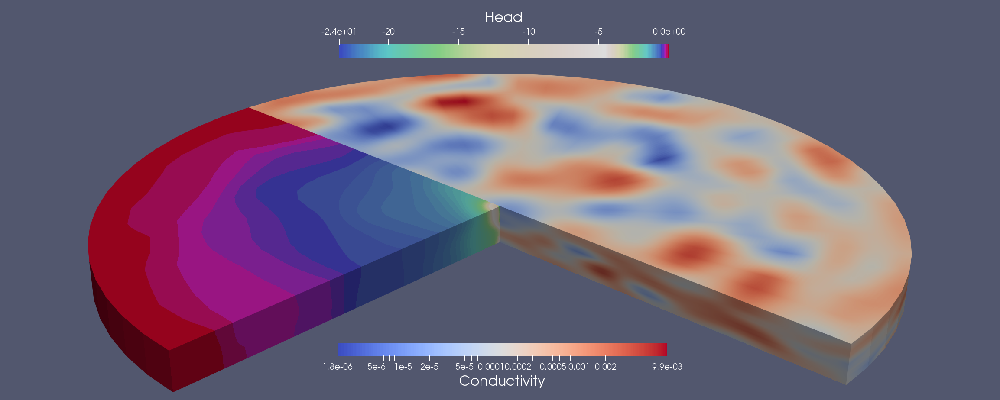

# Summary

The source code for ``ogs5py`` has been archived to Zenodo with the linked DOI: [@zenodo_ogs5py]

OpenGeoSys (OGS) is a scientific-computing project which provides tools and methods for the simulation of subsurface processes like groundwater flow, soil moisture dynamics, contaminant transport and geothermal energy extraction [@Kolditz2012]. It combines state-of-the-art finite-element solvers with an open-source approach, properties that set it apart from competitors like MODFLOW [@Modflow2005] or FEFLOW [@Trefry2007].
 
Yet being written completely in C++ and having no GUI, potential users without a strong background in computer science may find themselves confronted with a steep learning curve. While providing a GUI may lower the threshold for some and therefore widen the potential user base, it would starkly reduce flexibility in the development process, require the allocation of manpower needed elsewhere and make OGS far less platform independent. To strike a balance between usability, flexibility, effort and efficiency; a Python-based interface for OGS is the natural choice.
 
In this paper, we therefore present OGS5PY, a Python package which provides a Python representation of the full modeling process of OGS 5. Here, a full modeling process means the preparation of the OGS input files, initiating and inspecting the run of an OGS model and finally the import and visualization of the results. In addition, OGS5PY can import already existing OGS 5 projects and turn them into a fully Python-based work flow. We chose OGS 5 as the target platform since the newest version OGS 6, although already released, is still under development and therefore still in flux. Using the latest version of OGS 5 therefore guarantees a stable and mature numerical engine for any modeling effort. In addition to the powerful environment that the full SciPy stack (numpy, scipy, matplotlib, pandas etc.) offers, OGS5Py allows the user to make use of Python's powerful scripting abilities, thus facilitating the creation of tightly integrated workflows in which OGS would be one component. Examples would be the use of OGS to model a groundwater system in a larger hydrological model [@Jing2018], as a data-generating forward model in a Bayesian inference [@Savoy2017] or as part of a decision-making tool for water management services. In addition, OGS5PY provides nearly all benchmarks of OGS 5 as well as a number of convenience function in particular for working with mesh generation, inspection and manipulation.

# Example

To exemplify the capabilities of OGS5PY, we quickly demonstrate its potential through a coupling of OGS with GSTools [@zenodo_gstools], a Python-based environment for geostatistical applications. In this example, OGS 5 is used to numerically solve the groundwater flow equation under a pumping test scenario. Here a pumping test with pumping well in the center of a cylindrical three-dimensional domain is preformed until steady state is achieved. The groundwater medium is represented through a heterogeneous conductivity field, itself being generated by the random field generator of the the GSTools Python package. The conductivity field was generated as a Gaussian process model, with a Gaussian correlation function and an anisotropy between the vertical directions and the horizontal direction

```python
cov_model = Gaussian(dim=3, var=2, len_scale=10, anis=[1, 0.2])
srf = SRF(model=cov_model, mean=-9, seed=1000)
```

The full model script can be found on the github page of the OGS5PY project [1] and is not repeated here for the sake of brevity. After the generation of the OGS input files, OGS is run by simply writing

```python
model.write_input()
success = model.run_model()
```



The result can be seen in Figure 1, where the heterogeneous conductivity field from the GSTools package and the resulting head distribution of the pumping test are jointly displayed by virtue of a cross-section overlay of both. The depression cone caused by the pumping well can be seen in Figure 1 through the head distribution with a steep decline in the middle. Though overall symmetrical around the pumping well in the middle, the head distribution shows noticeable fluctuations caused by the heterogeneous conductivity field.

[1]: https://github.com/GeoStat-Framework/ogs5py/tree/master/examples/02_pump_test_het_3D.py

# Acknowledgements

Sebastian Müller:
I acknowledge the supervision by Prof. Sabine Attinger, Prof. Alraune Zech,
Prof. Peter Dietrich and Dr. Falk Heße and herewith want to thank them for
their trust and support.
I also want to thank Dr. Lennart Schüler for his constant help and the
pleasant partnership during the work on the GeoStat Framwork.
This research was funded by the German Federal Environmental Foundation.

Falk Heße:
I would like to acknowledge the support by Prof. Sabine Attinger. During the work on this project, I was financially supported by the Deutsche Forschungsgemeinschaft via Grant No. HE 7028/2-1.

# References
